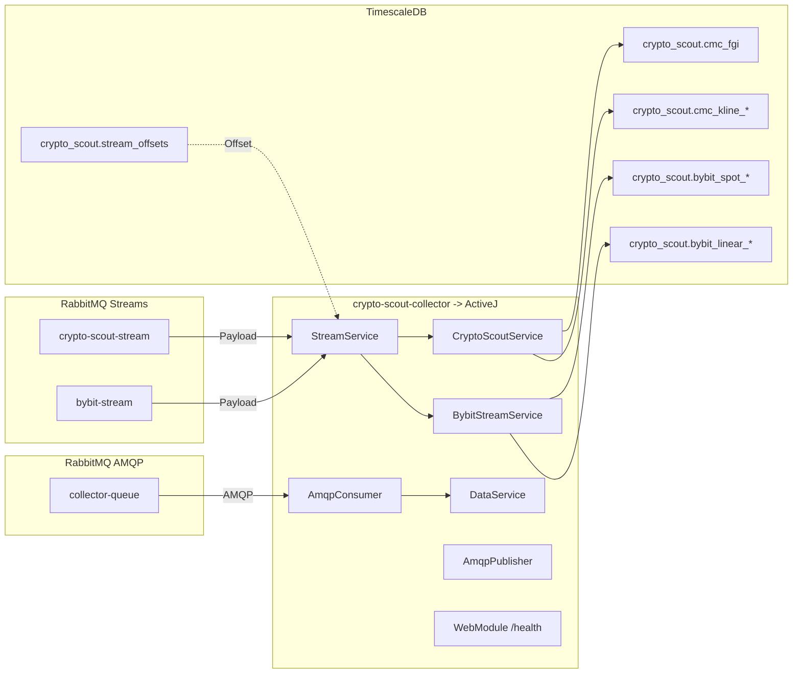

# AGENTS.md

This document provides guidelines for agentic coding contributors to the crypto-scout-collector module.

## Project Overview

**crypto-scout-collector** is a Java 25 microservice that consumes cryptocurrency market data from RabbitMQ Streams and persists it to TimescaleDB. It provides exactly-once processing semantics with database-backed offset management. Built on ActiveJ for high-performance async I/O.

| Attribute | Value |
|-----------|-------|
| **Language** | Java 25 |
| **Build Tool** | Maven |
| **Version** | 0.0.1 |
| **Framework** | ActiveJ 6.0-rc2 |
| **Database** | TimescaleDB (PostgreSQL 17) |
| **Connection Pool** | HikariCP 7.0.2 |
| **Messaging** | RabbitMQ Streams 1.4.0, AMQP 5.28.0 |
| **Java Files** | ~30 |

## Directory Structure

```
crypto-scout-collector/
├── script/                             # SQL scripts
│   ├── init.sql                        # Database initialization
│   ├── bybit_spot_tables.sql           # Bybit Spot market tables
│   ├── bybit_linear_tables.sql         # Bybit Linear market tables
│   ├── crypto_scout_tables.sql         # CMC and risk analysis tables
│   ├── analyst_tables.sql              # Analysis results tables
│   ├── btc_usd_daily_inserts.sql       # Historical BTC daily data
│   ├── btc_usd_weekly_inserts.sql      # Historical BTC weekly data
│   ├── cmc_fgi_inserts.sql             # CMC Fear & Greed Index data
│   ├── alternative_fgi_inserts.sql     # Alternative.me FGI data
│   └── network.sh                      # Network setup script
├── src/
│   └── main/
│       ├── java/com/github/akarazhev/cryptoscout/
│       │   ├── Collector.java                      # Main launcher (ActiveJ)
│       │   ├── collector/
│       │   │   ├── StreamService.java              # RabbitMQ Streams consumer
│       │   │   ├── BybitStreamService.java         # Bybit data processing
│       │   │   ├── CryptoScoutService.java         # CMC data processing
│       │   │   ├── DataService.java                # AMQP request handling
│       │   │   ├── AnalystService.java             # Analysis service integration
│       │   │   ├── AmqpConsumer.java               # AMQP queue consumer
│       │   │   ├── AmqpPublisher.java              # AMQP queue publisher
│       │   │   ├── HealthService.java              # Health check endpoint
│       │   │   ├── PayloadParser.java              # JSON payload parsing
│       │   │   ├── MovingAverageCalculator.java    # MA calculations
│       │   │   └── Constants.java                  # Collector constants
│       │   ├── collector/db/
│       │   │   ├── CollectorDataSource.java        # HikariCP connection pool
│       │   │   ├── BybitSpotRepository.java        # Spot market persistence
│       │   │   ├── BybitLinearRepository.java      # Linear market persistence
│       │   │   ├── CryptoScoutRepository.java      # CMC data persistence
│       │   │   ├── AnalystRepository.java          # Analysis results persistence
│       │   │   ├── StreamOffsetsRepository.java    # Offset management
│       │   │   ├── DBUtils.java                    # Database utilities
│       │   │   └── Constants.java                  # DB constants
│       │   ├── config/
│       │   │   ├── AmqpConfig.java                 # AMQP configuration
│       │   │   ├── JdbcConfig.java                 # JDBC configuration
│       │   │   ├── ServerConfig.java               # HTTP server config
│       │   │   ├── ConfigValidator.java            # Configuration validation
│       │   │   └── Constants.java                  # Config constants
│       │   └── module/
│       │       ├── CoreModule.java                 # DI core (reactor, executor)
│       │       ├── WebModule.java                  # HTTP server module
│       │       ├── CollectorModule.java            # Service wiring
│       │       └── Constants.java                  # Module constants
│       └── resources/
│           └── application.properties              # Application configuration
├── Dockerfile                          # Container image definition
├── podman-compose.yml                  # Container orchestration
├── pom.xml                             # Maven build configuration
├── README.md                           # Detailed documentation
└── LICENSE                             # MIT License
```

## Architecture



## Build, Test, and Run Commands

### Build
```bash
# Full build with tests
mvn clean install

# Quick build without tests
mvn -q -DskipTests install

# Build fat JAR only
mvn -q -DskipTests package
```

### Testing
```bash
# Run all tests
mvn test

# Run specific test class
mvn test -Dtest=BybitSpotRepositoryTest

# Run specific test method
mvn test -Dtest=BybitSpotRepositoryTest#shouldInsertTickersBatch

# Run with extended timeout
mvn -q -Dpodman.compose.up.timeout.min=5 test
```

### Run Application
```bash
# Set required environment variables
export AMQP_RABBITMQ_PASSWORD=your_mq_password
export JDBC_DATASOURCE_PASSWORD=your_db_password

# Run the collector
java -jar target/crypto-scout-collector-0.0.1.jar

# Health check
curl -s http://localhost:8081/health
```

### Clean
```bash
mvn clean
```

## Code Style Guidelines

### File Structure
```
1-23:   MIT License header
25:     Package declaration
26:     Blank line
27+:    Imports: java.* → third-party → static imports (blank lines between groups)
        Blank line
        Class/enum/interface declaration
```

### MIT License Header Template
```java
/*
 * MIT License
 *
 * Copyright (c) 2026 Andrey Karazhev
 *
 * Permission is hereby granted, free of charge, to any person obtaining a copy
 * of this software and associated documentation files (the "Software"), to deal
 * in the Software without restriction, including without limitation the rights
 * to use, copy, modify, merge, publish, distribute, sublicense, and/or sell
 * copies of the Software, and to permit persons to whom the Software is
 * furnished to do so, subject to the following conditions:
 *
 * The above copyright notice and this permission notice shall be included in all
 * copies or substantial portions of the Software.
 *
 * THE SOFTWARE IS PROVIDED "AS IS", WITHOUT WARRANTY OF ANY KIND, EXPRESS OR
 * IMPLIED, INCLUDING BUT NOT LIMITED TO THE WARRANTIES OF MERCHANTABILITY,
 * FITNESS FOR A PARTICULAR PURPOSE AND NONINFRINGEMENT. IN NO EVENT SHALL THE
 * AUTHORS OR COPYRIGHT HOLDERS BE LIABLE FOR ANY CLAIM, DAMAGES OR OTHER
 * LIABILITY, WHETHER IN AN ACTION OF CONTRACT, TORT OR OTHERWISE, ARISING FROM,
 * OUT OF OR IN CONNECTION WITH THE SOFTWARE OR THE USE OR OTHER DEALINGS IN THE
 * SOFTWARE.
 */
```

### Import Organization
```java
import java.io.IOException;
import java.sql.Connection;
import java.time.Duration;

import com.rabbitmq.stream.Environment;
import io.activej.inject.annotation.Inject;
import org.slf4j.Logger;
import org.slf4j.LoggerFactory;

import static com.github.akarazhev.cryptoscout.config.Constants.AmqpConfig.AMQP_RABBITMQ_HOST;
```

### Naming Conventions

| Element | Convention | Example |
|---------|------------|---------|
| Classes | PascalCase | `StreamService`, `BybitSpotRepository` |
| Methods | camelCase with verb prefix | `processPayload`, `insertBatch` |
| Constants | UPPER_SNAKE_CASE in nested classes | `JDBC_URL`, `BATCH_SIZE` |
| Parameters/locals | `final var` | `final var payload`, `final var conn` |
| Test classes | `<ClassName>Test` suffix | `StreamServiceTest` |
| Test methods | `should<Subject><Action>` | `shouldProcessPayloadAndStore` |

### Access Modifiers

**Utility Classes:**
```java
final class Constants {
    private Constants() {
        throw new UnsupportedOperationException();
    }
    
    static final String PATH_SEPARATOR = "/";
    
    final static class DB {
        private DB() {
            throw new UnsupportedOperationException();
        }
        
        static final String JDBC_URL = System.getProperty("jdbc.datasource.url", 
            "jdbc:postgresql://localhost:5432/crypto_scout");
    }
}
```

**Factory Pattern:**
```java
public final class StreamService {
    public static StreamService create(final Environment env, final StreamOffsetsRepository offsetsRepo) {
        return new StreamService(env, offsetsRepo);
    }
    
    private StreamService(final Environment env, final StreamOffsetsRepository offsetsRepo) {
        this.env = env;
        this.offsetsRepo = offsetsRepo;
    }
}
```

### Error Handling

**Unchecked Exceptions:**
```java
if (dataSource == null) {
    throw new IllegalStateException("DataSource not initialized");
}
```

**Try-with-Resources:**
```java
try (final var conn = dataSource.getConnection();
     final var stmt = conn.prepareStatement(sql);
     final var rs = stmt.executeQuery()) {
    while (rs.next()) {
        // Process results
    }
} catch (final SQLException e) {
    throw new IllegalStateException("Database query failed", e);
}
```

**Interrupt Handling:**
```java
try {
    Thread.sleep(flushInterval.toMillis());
} catch (final InterruptedException e) {
    Thread.currentThread().interrupt();
    LOGGER.warn("Flush thread interrupted");
}
```

**Exception Chaining:**
```java
throw new IllegalStateException("Failed to initialize stream consumer", e);
```

### Logging
```java
private static final Logger LOGGER = LoggerFactory.getLogger(StreamService.class);

LOGGER.info("Stream service started for stream: {}", streamName);
LOGGER.warn("Connection lost, attempting reconnect...");
LOGGER.error("Failed to process message", exception);
```

## Testing (JUnit 6/Jupiter)

### Test Class Structure
```java
final class BybitSpotRepositoryTest {
    
    @BeforeAll
    static void setUp() {
        PodmanCompose.up();
    }
    
    @AfterAll
    static void tearDown() {
        PodmanCompose.down();
    }
    
    @Test
    void shouldInsertTickersBatch() throws Exception {
        final var repository = BybitSpotRepository.create(dataSource);
        final var tickers = List.of(
            createTicker("BTCUSDT", 50000.0),
            createTicker("ETHUSDT", 3000.0)
        );
        
        repository.insertTickers(tickers);
        
        final var count = repository.countTickers();
        assertEquals(2, count);
    }
}
```

## Configuration

### System Properties Pattern
```java
static final String VALUE = System.getProperty("property.key", "defaultValue");
static final int PORT = Integer.parseInt(System.getProperty("port.key", "5552"));
static final Duration TIMEOUT = Duration.ofMinutes(Long.getLong("timeout.key", 3L));
```

### Key Configuration Properties

| Property | Default | Description |
|----------|---------|-------------|
| `server.port` | 8081 | HTTP server port |
| `amqp.rabbitmq.host` | localhost | RabbitMQ host |
| `amqp.rabbitmq.port` | 5672 | AMQP port |
| `amqp.stream.port` | 5552 | Streams port |
| `amqp.rabbitmq.username` | crypto_scout_mq | MQ username |
| `amqp.rabbitmq.password` | **REQUIRED** | MQ password (env: `AMQP_RABBITMQ_PASSWORD`) |
| `jdbc.datasource.url` | jdbc:postgresql://localhost:5432/crypto_scout | DB URL |
| `jdbc.datasource.username` | crypto_scout_db | DB username |
| `jdbc.datasource.password` | **REQUIRED** | DB password (env: `JDBC_DATASOURCE_PASSWORD`) |
| `jdbc.bybit.batch-size` | 1000 | Bybit batch size (1-10000) |
| `jdbc.crypto.scout.batch-size` | 100 | Crypto-scout batch size (1-10000) |
| `jdbc.bybit.flush-interval-ms` | 1000 | Bybit flush interval |
| `jdbc.crypto.scout.flush-interval-ms` | 1000 | Crypto-scout flush interval |

## Key Dependencies

| Dependency | Version | Purpose |
|------------|---------|---------|
| Java | 25 | Language |
| ActiveJ | 6.0-rc2 | Async I/O framework |
| jcryptolib | 0.0.4 | JSON utilities, stream abstractions |
| RabbitMQ Stream Client | 1.4.0 | Streams protocol |
| AMQP Client | 5.28.0 | AMQP protocol |
| PostgreSQL | 42.7.9 | Database driver |
| HikariCP | 7.0.2 | Connection pooling |
| JUnit | 6.1.0-M1 | Testing |

## Database Schema

### Tables

**Stream Offsets:**
- `crypto_scout.stream_offsets` - Tracks consumer offsets for exactly-once semantics

**Bybit Spot Market:**
- `crypto_scout.bybit_spot_tickers` - Real-time ticker data
- `crypto_scout.bybit_spot_kline_{1m,5m,15m,60m,240m,1d}` - OHLCV candles
- `crypto_scout.bybit_spot_public_trade` - Individual trades
- `crypto_scout.bybit_spot_order_book_{1,50,200,1000}` - Order book snapshots

**Bybit Linear Market:**
- `crypto_scout.bybit_linear_tickers` - Perpetual futures tickers
- `crypto_scout.bybit_linear_kline_{1m,5m,15m,60m,240m,1d}` - OHLCV candles
- `crypto_scout.bybit_linear_public_trade` - Individual trades
- `crypto_scout.bybit_linear_order_book_{1,50,200,1000}` - Order book snapshots
- `crypto_scout.bybit_linear_all_liquidation` - Liquidation events

**Crypto Scout Data:**
- `crypto_scout.cmc_fgi` - Fear & Greed Index
- `crypto_scout.cmc_kline_1d` / `cmc_kline_1w` - BTC/USD daily/weekly klines
- `crypto_scout.btc_price_risk` - Risk-to-price mapping
- `crypto_scout.btc_risk_price` - Current risk assessment

## Resource Management

- **Try-with-resources**: Required for all closeable resources (`Connection`, `Statement`, `ResultSet`)
- **Null checks**: Throw `IllegalStateException` with descriptive message
- **Timeout handling**: Include timeout value in error message
- **Batch processing**: Use configurable batch sizes with periodic flushes
- **Offset management**: Atomic updates with data writes for exactly-once semantics

## Concurrency

- **Volatile fields**: For lazy-initialized singleton-style fields
- **Thread naming**: Provide names for background threads (e.g., flush scheduler)
- **Daemon threads**: Set for background readers that shouldn't block JVM shutdown
- **Interrupt status**: Always restore when catching `InterruptedException`
- **Concurrent flush protection**: Ensure only one flush operation runs at a time

## Container Development

### Start Infrastructure
```bash
# Create network
podman network create crypto-scout-bridge

# Start TimescaleDB and backup sidecar
podman-compose up -d
```

### Build and Run Collector
```bash
# Build JAR
mvn -q -DskipTests package

# Build container image
podman-compose build crypto-scout-collector

# Start full stack
podman-compose up -d

# Health check
curl http://localhost:8081/health
```

### Database Operations
```bash
# Connect to database
podman exec -it crypto-scout-collector-db psql -U crypto_scout_db -d crypto_scout

# List tables
\dt crypto_scout.*

# Check table counts
SELECT COUNT(*) FROM crypto_scout.bybit_spot_tickers;
SELECT COUNT(*) FROM crypto_scout.cmc_fgi;
SELECT * FROM crypto_scout.stream_offsets;
```

## Security Best Practices

- **No hardcoded credentials** - Use environment variables or system properties
- **Secret files** - Store in `secret/` directory with 600 permissions
- **Container security** - Non-root user, read-only filesystem, dropped capabilities
- **Validation** - Validate all configuration at startup in `ConfigValidator`
- **Password requirements** - Fail fast with clear error messages if passwords not set

## Troubleshooting

| Issue | Possible Cause | Solution |
|-------|---------------|----------|
| "Configuration validation failed" | Missing passwords | Set `AMQP_RABBITMQ_PASSWORD` and `JDBC_DATASOURCE_PASSWORD` |
| "batch-size must be between 1 and 10000" | Invalid config | Check `jdbc.*.batch-size` values |
| No data in DB | Stream connection issue | Verify RabbitMQ host/ports, stream names |
| DB connection errors | Invalid credentials | Confirm `jdbc.datasource.*` values and DB health |
| Init script not applied | Data directory not empty | Re-initialize `./data/postgresql` or apply DDL manually |

## License

MIT License - See `LICENSE` file.
