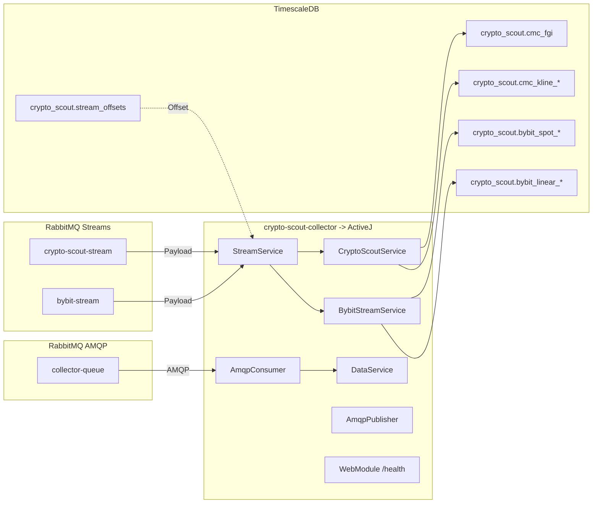

# crypto-scout-collector

Event-driven collector that ingests crypto market metrics from RabbitMQ Streams into TimescaleDB, with automated
backups.

## Overview

`crypto-scout-collector` is a Java 25, event-driven service that consumes messages from RabbitMQ Streams and persists
structured, time-series data into TimescaleDB. The repository includes a production-ready TimescaleDB setup with
automated daily backups via a sidecar container.

- **Technologies:** Java 25, ActiveJ, RabbitMQ Streams, PostgreSQL/TimescaleDB, HikariCP, SLF4J/Logback
- **DB and backups containers:** `podman-compose.yml` using `timescale/timescaledb:latest-pg17` and
  `prodrigestivill/postgres-backup-local`
- **App entrypoint:** `com.github.akarazhev.cryptoscout.Collector`
- **Health endpoint:** `GET /health` → JSON with database and AMQP status
- **DB bootstrap and DDL scripts:** `script/init.sql`, `script/bybit_spot_tables.sql`, `script/bybit_linear_tables.sql`,
  `script/crypto_scout_tables.sql`
- **Data seed scripts:** `script/btc_usd_daily_inserts.sql`, `script/btc_usd_weekly_inserts.sql`,
  `script/cmc_fgi_inserts.sql`, `script/alternative_fgi_inserts.sql`

## Architecture



Key modules/classes:

- `src/main/java/com/github/akarazhev/cryptoscout/Collector.java` — ActiveJ `Launcher` combining modules.
- `src/main/java/com/github/akarazhev/cryptoscout/config/ConfigValidator.java` — Validates required configuration
  properties on startup.
- `src/main/java/com/github/akarazhev/cryptoscout/module/CoreModule.java` — single-threaded reactor + virtual-thread
  executor.
- `src/main/java/com/github/akarazhev/cryptoscout/module/CollectorModule.java` — DI wiring for repositories and
  services; starts `StreamService`, `AmqpConsumer`, and `AmqpPublisher` eagerly.
- `src/main/java/com/github/akarazhev/cryptoscout/module/WebModule.java` — HTTP server exposing `/health`.
- `src/main/java/com/github/akarazhev/cryptoscout/collector/StreamService.java` — subscribes to RabbitMQ Streams and
  dispatches payloads to `BybitStreamService` and `CryptoScoutService`.
- `src/main/java/com/github/akarazhev/cryptoscout/collector/BybitStreamService.java` — processes Bybit stream data
  (spot & linear) with batching and scheduled flushes.
- `src/main/java/com/github/akarazhev/cryptoscout/collector/CryptoScoutService.java` — processes crypto-scout stream
  data (CMC FGI and BTC/USD klines) with batching.
- `src/main/java/com/github/akarazhev/cryptoscout/collector/DataService.java` — handles AMQP request/response messages
  and coordinates publishers.
- `src/main/java/com/github/akarazhev/cryptoscout/collector/AmqpConsumer.java` — consumes from AMQP queues with
  automatic reconnection.
- `src/main/java/com/github/akarazhev/cryptoscout/collector/AmqpPublisher.java` — publishes to AMQP queues with
  publisher confirms and automatic reconnection.
- `src/main/java/com/github/akarazhev/cryptoscout/collector/db/*Repository.java` — JDBC/Hikari-based writes with
  batching and transactional offset updates.

## Database schema and policies

The repository ships SQL split by concern. On fresh cluster initialization, scripts under `/docker-entrypoint-initdb.d/`
are executed in lexical order:

- `script/init.sql` → installs extensions, creates schema `crypto_scout`, sets `search_path`, creates
  `crypto_scout.stream_offsets`, and grants/default privileges.
- `script/bybit_spot_tables.sql` → Bybit Spot tables and policies:
    - `crypto_scout.bybit_spot_tickers` (spot tickers)
    - `crypto_scout.bybit_spot_kline_{1m,5m,15m,60m,240m,1d}` (confirmed klines)
    - `crypto_scout.bybit_spot_public_trade` (1 row per trade)
    - `crypto_scout.bybit_spot_order_book_{1,50,200,1000}` (1 row per book level)
    - Indexes, hypertables, compression, reorder, and retention policies
- `script/bybit_linear_tables.sql` → Bybit Linear (Perps/Futures) tables and policies:
    - `crypto_scout.bybit_linear_tickers`
    - `crypto_scout.bybit_linear_kline_{1m,5m,15m,60m,240m,1d}` (confirmed klines)
    - `crypto_scout.bybit_linear_public_trade` (1 row per trade)
    - `crypto_scout.bybit_linear_order_book_{1,50,200,1000}` (1 row per book level)
    - `crypto_scout.bybit_linear_all_liquidation` (all-liquidations stream)
    - Indexes, hypertables, compression, reorder, and retention policies
- `script/crypto_scout_tables.sql` → CMC and risk analysis tables:
    - `crypto_scout.cmc_fgi` (Fear & Greed Index)
    - `crypto_scout.cmc_kline_1d` / `cmc_kline_1w` (BTC/USD daily/weekly klines)
    - `crypto_scout.btc_price_risk` (risk-to-price mapping)
    - `crypto_scout.btc_risk_price` (current risk assessment)
    - Indexes, hypertables, compression, and reorder policies
- Data seed scripts (historical data):
    - `script/btc_usd_daily_inserts.sql` → BTC/USD daily kline inserts
    - `script/btc_usd_weekly_inserts.sql` → BTC/USD weekly kline inserts
    - `script/cmc_fgi_inserts.sql` → CMC Fear & Greed Index historical data
    - `script/alternative_fgi_inserts.sql` → Alternative.me Fear & Greed Index historical data

## Containers: TimescaleDB + Backups

The repository ships a `podman-compose.yml` with:

- `crypto-scout-collector-db` — `timescale/timescaledb:latest-pg17`
    - Mounts `./data/postgresql` for data and SQL scripts under `/docker-entrypoint-initdb.d/` in order:
        - `./script/init.sql` → `/docker-entrypoint-initdb.d/00-init.sql`
        - `./script/bybit_spot_tables.sql` → `/docker-entrypoint-initdb.d/01_bybit_spot_tables.sql`
        - `./script/bybit_linear_tables.sql` → `/docker-entrypoint-initdb.d/02_bybit_linear_tables.sql`
        - `./script/crypto_scout_tables.sql` → `/docker-entrypoint-initdb.d/03_crypto_scout_tables.sql`
        - `./script/btc_usd_daily_inserts.sql` → `/docker-entrypoint-initdb.d/04_btc_usd_daily_inserts.sql`
        - `./script/btc_usd_weekly_inserts.sql` → `/docker-entrypoint-initdb.d/05_btc_usd_weekly_inserts.sql`
        - `./script/cmc_fgi_inserts.sql` → `/docker-entrypoint-initdb.d/06_cmc_fgi_inserts.sql`
        - `./script/alternative_fgi_inserts.sql` → `/docker-entrypoint-initdb.d/07_alternative_fgi_inserts.sql`
    - Healthcheck via `pg_isready`.
    - Tuned Postgres/TimescaleDB settings and `pg_stat_statements` enabled.
- `crypto-scout-collector-backup` — `prodrigestivill/postgres-backup-local:latest`
    - Writes backups to `./backups` on the host.
    - Schedule and retention configured via env file.

Secrets and env files (gitignored) live in `secret/`:

- `secret/timescaledb.env` — DB name/user/password and TimescaleDB tuning values. See `secret/timescaledb.env.example`
  and `secret/README.md`.
- `secret/postgres-backup.env` — backup schedule/retention and DB connection for the backup sidecar. See
  `secret/postgres-backup.env.example` and `secret/README.md`.
- `secret/collector.env` — Application runtime configuration (passwords, hosts, ports).

Quick start for DB and backups:

```bash
# 1) Prepare secrets (copy examples and edit values)
cp ./secret/timescaledb.env.example ./secret/timescaledb.env
cp ./secret/postgres-backup.env.example ./secret/postgres-backup.env
chmod 600 ./secret/*.env

# 2) Start TimescaleDB and backup sidecar
podman-compose -f podman-compose.yml up -d
# Optionally, if using Docker:
# docker compose -f podman-compose.yml up -d
```

Notes:

- `script/init.sql` runs only during initial cluster creation (empty data dir). Re-initialize `./data/postgresql` to
  re-run.
- For existing databases, apply the DDL scripts manually using `psql`, for example:
    - `psql -h <host> -U crypto_scout_db -d crypto_scout -f script/bybit_spot_tables.sql`
    - `psql -h <host> -U crypto_scout_db -d crypto_scout -f script/bybit_linear_tables.sql`
    - `psql -h <host> -U crypto_scout_db -d crypto_scout -f script/crypto_scout_tables.sql`
- For stronger auth at bootstrap, include `POSTGRES_INITDB_ARGS=--auth=scram-sha-256` in `secret/timescaledb.env` before
  first start.

## Application configuration

Default configuration is in `src/main/resources/application.properties`:

- **Server**
    - `server.port` (default `8081`)
- **RabbitMQ**
    - `amqp.rabbitmq.host` (default `localhost`)
    - `amqp.rabbitmq.username` (default `crypto_scout_mq`)
    - `amqp.rabbitmq.password` (**REQUIRED** — empty by default, must be set via env)
    - `amqp.rabbitmq.port` (default `5672`)
    - `amqp.stream.port` (default `5552`)
    - `amqp.bybit.stream` (default `bybit-stream`)
    - `amqp.bybit.ta.stream` (default `bybit-ta-stream`)
    - `amqp.crypto.scout.stream` (default `crypto-scout-stream`)
    - `amqp.crypto.scout.exchange`, `amqp.collector.queue`, `amqp.chatbot.queue`
- **JDBC / HikariCP**
    - `jdbc.datasource.url` (default `jdbc:postgresql://localhost:5432/crypto_scout`)
    - `jdbc.datasource.username` (default `crypto_scout_db`)
    - `jdbc.datasource.password` (**REQUIRED** — empty by default, must be set via env)
    - `jdbc.crypto.scout.batch-size` (default `100`, range: 1-10000)
    - `jdbc.crypto.scout.flush-interval-ms` (default `1000`)
    - `jdbc.bybit.batch-size` (default `1000`, range: 1-10000)
    - `jdbc.bybit.flush-interval-ms` (default `1000`)
    - HikariCP pool configuration (`maximum-pool-size`, `minimum-idle`, etc.)

**Important:** Passwords must be set via environment variables:
```bash
export AMQP_RABBITMQ_PASSWORD=your_mq_password
export JDBC_DATASOURCE_PASSWORD=your_db_password
```

The application validates all required configuration on startup and fails fast with clear error messages if any
required properties are missing or invalid.

When running the app in a container on the same compose network as the DB, set `jdbc.datasource.url` host to
`crypto-scout-collector-db` (the compose service name), e.g.
`jdbc:postgresql://crypto-scout-collector-db:5432/crypto_scout`.

To change configuration, edit `src/main/resources/application.properties` and rebuild. Ensure your RabbitMQ host/ports
and DB credentials match your environment.

## Build and run (local)

```bash
# Build fat JAR
mvn -q -DskipTests package

# Run the app with environment variables
export AMQP_RABBITMQ_PASSWORD=your_mq_password
export JDBC_DATASOURCE_PASSWORD=your_db_password
java -jar target/crypto-scout-collector-0.0.1.jar

# Health check (returns JSON)
curl -s http://localhost:8081/health
# -> {"status":"UP","database":{"status":"UP"},"amqp":{"status":"UP"}}
```

Ensure RabbitMQ (with Streams enabled, reachable on `amqp.stream.port`) and TimescaleDB are reachable using the
configured hosts/ports.

## Offset management

- **Crypto-scout stream (external offsets):** `StreamService` disables server-side offset tracking and uses a DB-backed
  offset in `crypto_scout.stream_offsets`.
    - On startup, the consumer reads the last stored offset and subscribes from `offset + 1` (or from `first` if
      absent).
    - `CryptoScoutService` batches inserts and, on flush, atomically inserts data and upserts the max processed offset.
    - Rationale: offsets are stored in the same transactional boundary as data writes for strong exactly-once
      semantics.
    - Concurrent flush protection ensures only one flush operation runs at a time.
- **Bybit stream (external offsets):** the `bybit-stream` uses the same DB-backed offset approach.
    - On startup, `StreamService` reads `bybit-stream` offset from DB and subscribes from `offset + 1`.
    - `BybitStreamService` batches inserts and updates the max processed offset in one transaction.
    - Supports both spot (PMST) and linear (PML) data sources.

Migration note: `script/init.sql` creates `crypto_scout.stream_offsets` on first bootstrap. If your DB is already
initialized, apply the DDL manually or re-initialize the data directory to pick up the new table.

## Run the collector in a container

The `podman-compose.yml` now includes the `crypto-scout-collector` service. The `Dockerfile` uses a minimal Temurin
JRE 25 Alpine base and runs as a non-root user.

Prerequisites:

- Build the shaded JAR: `mvn -q -DskipTests package` (required before building the image).
- Create the external network (one time): `./script/network.sh` → creates `crypto-scout-bridge`.
- Prepare secrets:
    - `cp ./secret/timescaledb.env.example ./secret/timescaledb.env`
    - `cp ./secret/postgres-backup.env.example ./secret/postgres-backup.env`
    - `cp ./secret/collector.env.example ./secret/collector.env`
    - `chmod 600 ./secret/*.env`

Edit `./secret/collector.env` and set individual environment variables. By default, the application uses
`src/main/resources/application.properties`. If you need runtime overrides driven by env vars, either adjust the compose
to pass JVM `-D` flags or update `application.properties` and rebuild. Minimal required keys:

```env
# Server
SERVER_PORT=8081

# RabbitMQ Streams
AMQP_RABBITMQ_HOST=<rabbitmq_host>
AMQP_RABBITMQ_PORT=5672
AMQP_STREAM_PORT=5552
AMQP_RABBITMQ_USERNAME=crypto_scout_mq
AMQP_RABBITMQ_PASSWORD=REDACTED

# JDBC
JDBC_DATASOURCE_URL=jdbc:postgresql://crypto-scout-collector-db:5432/crypto_scout
JDBC_DATASOURCE_USERNAME=crypto_scout_db
JDBC_DATASOURCE_PASSWORD=REDACTED
```

Start the stack with Podman Compose:

```bash
# Build images (collector depends on the shaded JAR)
podman-compose -f podman-compose.yml build crypto-scout-collector

# Start DB + backups + collector
podman-compose -f podman-compose.yml up -d

# Health check
curl -s http://localhost:8081/health
```

Notes:

- `crypto-scout-collector` joins the external network `crypto-scout-bridge` alongside the DB and backup services.
- Ensure `amqp.rabbitmq.host` in `collector.env` resolves from within the compose network (e.g., a RabbitMQ container
  name or a reachable host).
- Container security: non-root user, `read_only` root FS with `tmpfs:/tmp`, `no-new-privileges`, and ulimit tuning are
  applied in `podman-compose.yml`.

## Backups and restore

Backups are produced by the `crypto-scout-collector-backup` sidecar into `./backups` per the schedule and retention in
`secret/postgres-backup.env`.

Restore guidance (adjust to the backup file format):

```bash
# If backup is a custom format dump (.dump), use pg_restore
pg_restore -h <host> -p 5432 -U crypto_scout_db -d crypto_scout <path_to_backup.dump>

# If backup is a plain SQL file (.sql), use psql
psql -h <host> -p 5432 -U crypto_scout_db -d crypto_scout -f <path_to_backup.sql>
```

Always validate restore procedures in a non-production environment.

## Health and operations

- **HTTP health:** `GET /health` returns JSON with overall status and component health:
  ```json
  {
    "status": "UP",
    "database": {"status": "UP"},
    "amqp": {"status": "UP"}
  }
  ```
  Returns HTTP 200 when healthy, HTTP 503 when degraded.
- **Logs:** SLF4J/Logback (console appender, INFO level).
- **Execution model:** non-blocking reactor for orchestration; blocking JDBC work delegated to a virtual-thread executor.
- **Batch processing:** Configurable batch sizes with periodic flush intervals to optimize database writes.
- **Automatic reconnection:** AMQP consumers and publishers automatically reconnect on connection loss (up to 10 attempts
  with 5-second delays).

## Troubleshooting

| Issue | Possible Cause | Solution |
|-------|---------------|----------|
| Application fails to start with "Configuration validation failed" | Missing required environment variables | Set `AMQP_RABBITMQ_PASSWORD` and `JDBC_DATASOURCE_PASSWORD` |
| "batch-size must be between 1 and 10000" error | Invalid batch size configuration | Check `jdbc.*.batch-size` values in configuration |
| No data in DB | RabbitMQ Streams connection issue | Verify host/ports, stream names, and message providers/sources |
| DB connection errors | Invalid credentials or unhealthy DB | Confirm `jdbc.datasource.*` values and TimescaleDB health (`pg_isready`) |
| Init script not applied | Data directory not empty | Ensure `./data/postgresql` was empty on first run or re-initialize |
| Concurrent modification warnings | N/A (fixed in recent updates) | Ensure you're running the latest version with flush protection |

## Recent Updates

### Code Quality Improvements (2026-02)
- Fixed critical bug: `CryptoScoutRepository` now correctly uses `getCryptoScoutBatchSize()` instead of `getBybitBatchSize()`
- Added concurrent flush protection to prevent overlapping database transactions
- Added password validation on startup with clear error messages
- Added batch size bounds checking (1-10000) to prevent misconfiguration
- Added null checks for order book bids/asks processing
- Fixed offset upsert to validate offset >= 0 before database write
- Updated copyright year to 2026

## License

MIT — see `LICENSE`.
