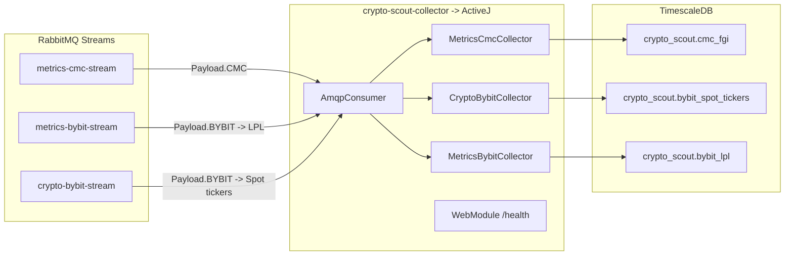

# crypto-scout-collector

Event-driven collector that ingests crypto market metrics from RabbitMQ Streams into TimescaleDB, with automated
backups.

## Overview

`crypto-scout-collector` is a Java 25, event-driven service that consumes messages from RabbitMQ Streams and persists
structured, time-series data into TimescaleDB. The repository includes a production-ready TimescaleDB setup with
automated daily backups via a sidecar container.

- Technologies: Java 25, ActiveJ, RabbitMQ Streams, PostgreSQL/TimescaleDB, HikariCP, SLF4J/Logback
- DB provisioning and policies: `script/init.sql`
- DB and backups containers: `podman-compose.yml` using `timescale/timescaledb:latest-pg17` and
  `prodrigestivill/postgres-backup-local`
- App entrypoint: `com.github.akarazhev.cryptoscout.Collector`
- Health endpoint: `GET /health` → `ok`

## Architecture



Key modules/classes:

- `src/main/java/com/github/akarazhev/cryptoscout/Collector.java` — ActiveJ `Launcher` combining modules.
- `src/main/java/com/github/akarazhev/cryptoscout/module/CoreModule.java` — single-threaded reactor + virtual-thread
  executor.
- `src/main/java/com/github/akarazhev/cryptoscout/module/CollectorModule.java` — DI wiring for repositories and
  collectors; starts `AmqpConsumer` eagerly.
- `src/main/java/com/github/akarazhev/cryptoscout/module/WebModule.java` — HTTP server exposing `/health`.
- `src/main/java/com/github/akarazhev/cryptoscout/collector/AmqpConsumer.java` — subscribes to RabbitMQ Streams and
  dispatches payloads.
- `src/main/java/com/github/akarazhev/cryptoscout/collector/*Collector.java` — batch/interval buffered writes to DB.
- `src/main/java/com/github/akarazhev/cryptoscout/collector/db/*Repository.java` — JDBC/Hikari-based writes.

## Database schema and policies

The TimescaleDB schema is created and managed by `script/init.sql` (mounted into the container at
`/docker-entrypoint-initdb.d/init.sql`). On first cluster initialization it will:

- Create schema: `crypto_scout` and set search_path.
- Create hypertables:
    - `crypto_scout.cmc_fgi` (FGI metrics)
    - `crypto_scout.bybit_spot_tickers` (Bybit spot tickers)
    - `crypto_scout.bybit_lpl` (Bybit Launch Pool data)
    - `crypto_scout.stream_offsets` (external consumer offsets; used by CMC)
- Add indexes, compression settings, reorder and retention policies (e.g., 7-day compression window, retention 180–730
  days depending on the table).
- Grant privileges to the application DB role `crypto_scout_db`.

Review `script/init.sql` before production rollouts to validate chunk sizes, compression and retention policies against
your workload.

## Containers: TimescaleDB + Backups

The repository ships a `podman-compose.yml` with:

- `crypto-scout-collector-db` — `timescale/timescaledb:latest-pg17`
    - Mounts `./data/postgresql` for data and `./script/init.sql` for bootstrap.
    - Healthcheck via `pg_isready`.
    - Tuned Postgres/TimescaleDB settings and `pg_stat_statements` enabled.
- `crypto-scout-collector-backup` — `prodrigestivill/postgres-backup-local:latest`
    - Writes backups to `./backups` on the host.
    - Schedule and retention configured via env file.

Secrets and env files (gitignored) live in `secret/`:

- `secret/timescaledb.env` — DB name/user/password and TimescaleDB tuning values. See `secret/timescaledb.env.example`
  and `secret/README.md`.
- `secret/postgres-backup.env` — backup schedule/retention and DB connection for the backup sidecar. See
  `secret/postgres-backup.env.example` and `secret/README.md`.

Quick start for DB and backups:

```bash
# 1) Prepare secrets (copy examples and edit values)
cp ./secret/timescaledb.env.example ./secret/timescaledb.env
cp ./secret/postgres-backup.env.example ./secret/postgres-backup.env
chmod 600 ./secret/*.env

# 2) Start TimescaleDB and backup sidecar
podman-compose -f podman-compose.yml up -d
# Optionally, if using Docker:
# docker compose -f podman-compose.yml up -d
```

Notes:

- `script/init.sql` runs only during initial cluster creation (empty data dir). Re-initialize `./data/postgresql` to
  re-run.
- For stronger auth at bootstrap, include `POSTGRES_INITDB_ARGS=--auth=scram-sha-256` in `secret/timescaledb.env` before
  first start.

## Application configuration

Default configuration is in `src/main/resources/application.properties`:

- Server
    - `server.port` (default `8081`)
- RabbitMQ
    - `amqp.rabbitmq.host` (default `localhost`)
    - `amqp.rabbitmq.username` (default `crypto_scout_mq`)
    - `amqp.rabbitmq.password` (empty by default)
    - `amqp.rabbitmq.port` (default `5672`)
    - `amqp.stream.port` (default `5552`)
    - `amqp.crypto.bybit.stream` (default `crypto-bybit-stream`)
    - `amqp.metrics.bybit.stream` (default `metrics-bybit-stream`)
    - `amqp.metrics.cmc.stream` (default `metrics-cmc-stream`)
    - `amqp.collector.exchange`, `amqp.collector.queue`
- JDBC / HikariCP
    - `jdbc.datasource.url` (default `jdbc:postgresql://localhost:5432/crypto_scout`)
    - `jdbc.datasource.username` (default `crypto_scout_db`)
    - `jdbc.datasource.password`
    - Batched insert settings and HikariCP pool configuration

When running the app in a container on the same compose network as the DB, set `jdbc.datasource.url` host to
`crypto-scout-collector-db` (the compose service name), e.g.
`jdbc:postgresql://crypto-scout-collector-db:5432/crypto_scout`.

To change configuration, edit `src/main/resources/application.properties` and rebuild. Ensure your RabbitMQ host/ports
and DB credentials match your environment.

## Build and run (local)

```bash
# Build fat JAR
mvn -q -DskipTests package

# Run the app
java -jar target/crypto-scout-collector-0.0.1.jar

# Health check
curl -s http://localhost:8081/health
# -> ok
```

Ensure RabbitMQ (with Streams enabled, reachable on `amqp.stream.port`) and TimescaleDB are reachable using the
configured hosts/ports.

## Offset management

- **CMC stream (external offsets):** `AmqpConsumer` disables server-side offset tracking and uses a DB-backed offset in
  `crypto_scout.stream_offsets`.
  - On startup, the consumer reads the last stored offset and subscribes from `offset + 1` (or from `first` if absent).
  - `MetricsCmcCollector` batches inserts and, on flush, atomically inserts data and upserts the max processed offset.
  - Rationale: offsets are stored in the same transactional boundary as data writes for strong at-least-once semantics.
- **Bybit metrics stream (external offsets):** the `metrics-bybit-stream` uses the same DB-backed offset approach.
  - On startup, `AmqpConsumer` reads `metrics-bybit-stream` offset from DB and subscribes from `offset + 1`.
  - `MetricsBybitCollector` batches inserts and updates the max processed offset in one transaction.
- **Bybit spot stream:** `crypto-bybit-stream` continues using RabbitMQ server-side offset tracking with manual ack.

Migration note: `script/init.sql` creates `crypto_scout.stream_offsets` on first bootstrap. If your DB is already
initialized, apply the DDL manually or re-initialize the data directory to pick up the new table.

## Run the collector in a container

The `podman-compose.yml` now includes the `crypto-scout-collector` service. The `Dockerfile` uses a minimal Temurin
JRE 25 Alpine base and runs as a non-root user.

Prerequisites:

- Build the shaded JAR: `mvn -q -DskipTests package` (required before building the image).
- Create the external network (one time): `./script/network.sh` → creates `crypto-scout-bridge`.
- Prepare secrets:
    - `cp ./secret/timescaledb.env.example ./secret/timescaledb.env`
    - `cp ./secret/postgres-backup.env.example ./secret/postgres-backup.env`
    - `cp ./secret/collector.env.example ./secret/collector.env`
    - `chmod 600 ./secret/*.env`

Edit `./secret/collector.env` and set individual environment variables. By default, the application uses
`src/main/resources/application.properties`. If you need runtime overrides driven by env vars, either adjust the compose
to pass JVM `-D` flags or update `application.properties` and rebuild. Minimal required keys:

```env
# Server
SERVER_PORT=8081

# RabbitMQ Streams
AMQP_RABBITMQ_HOST=<rabbitmq_host>
AMQP_RABBITMQ_PORT=5672
AMQP_STREAM_PORT=5552
AMQP_RABBITMQ_USERNAME=crypto_scout_mq
AMQP_RABBITMQ_PASSWORD=REDACTED

# JDBC
JDBC_DATASOURCE_URL=jdbc:postgresql://crypto-scout-collector-db:5432/crypto_scout
JDBC_DATASOURCE_USERNAME=crypto_scout_db
JDBC_DATASOURCE_PASSWORD=REDACTED
```

Start the stack with Podman Compose:

```bash
# Build images (collector depends on the shaded JAR)
podman-compose -f podman-compose.yml build crypto-scout-collector

# Start DB + backups + collector
podman-compose -f podman-compose.yml up -d

# Health check
curl -s http://localhost:8081/health  # -> ok
```

Notes:

- `crypto-scout-collector` joins the external network `crypto-scout-bridge` alongside the DB and backup services.
- Ensure `amqp.rabbitmq.host` in `collector.env` resolves from within the compose network (e.g., a RabbitMQ container
  name or a reachable host).
- Container security: non-root user, `read_only` root FS with `tmpfs:/tmp`, `no-new-privileges`, and ulimit tuning are
  applied in `podman-compose.yml`.

## Backups and restore

Backups are produced by the `crypto-scout-collector-backup` sidecar into `./backups` per the schedule and retention in
`secret/postgres-backup.env`.

Restore guidance (adjust to the backup file format):

```bash
# If backup is a custom format dump (.dump), use pg_restore
pg_restore -h <host> -p 5432 -U crypto_scout_db -d crypto_scout <path_to_backup.dump>

# If backup is a plain SQL file (.sql), use psql
psql -h <host> -p 5432 -U crypto_scout_db -d crypto_scout -f <path_to_backup.sql>
```

Always validate restore procedures in a non-production environment.

## Health and operations

- HTTP health: `GET /health` returns `ok`.
- Logs: configured via `src/main/resources/logback.xml` (console appender, INFO level).
- Execution model: non-blocking reactor for orchestration; blocking JDBC work delegated to a virtual-thread executor.

## Troubleshooting

- No data in DB: verify RabbitMQ Streams connection (host/ports), stream names, and that messages contain expected
  providers/sources.
- DB connection errors: confirm `jdbc.datasource.*` values and that TimescaleDB is healthy (`pg_isready`).
- Init script not applied: ensure `./data/postgresql` was empty on first run or re-initialize to rerun bootstrap SQL.

## License

MIT — see `LICENSE`.
